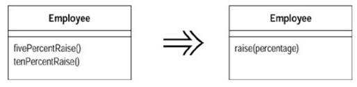

### Rename Method (重新命名函数)

函数的名称需要准确揭示函数的功能。不要使用意义不明的缩写，不要因为害怕函数名太长而起一个模糊不清的名字。

为函数起一个好名称的小技巧是：先考虑应该给函数写上一句怎样的注释，然后想办法把注释变成函数名。

### Add Parameter (添加参数)

Add Parameter 是一个很常用的重构手法，你一定已经使用过。

这里强调一下不适合使用此种重构方法的时机：
1. 有没有可能不通过传参数的形式获取你想要的信息？比如调用某个函数获得数据或是函数已经是当前对象的成员变量。
2. 如果参数太多，应该考虑使用 Introduce Parameter Object 将经常一起出现的一组参数集合成一个参数对象

### Remove Parameter (移除参数)

函数本体（method body）不再需要某个参数，将该参数去除。

### separate Query from Modifier (将查询函数和修改函数分离)

如果某个函数既返回对象状态值，又修改对象状态。

那么应该建立两个不同的函数，其中一个负责查询，另一个负责修改。

如果某个函数只是向你提供一个值，没有任何看得到的副作用（或说连带影响），那么这是个很有价值的东西。 你可以任意调用这个函数，也可以把调用动作搬到函 数的其他地方。简而言之，需要操心的事情少多了。

明确表现出「有副作用」与「无副作用」两种函数之间的差异，是个很好的想法。 下而是一条好规则：任何有返回值的函 数，都不应该有看得到的副作用。

如果你遇到一个「既有返回值又有副作用」的函数，就应该试着将查询动作从修改 动作中分割出来。

### Parameterize Method (令函数携带参数)

如果两个函数做着类似的工作，行为只因少数几个参数值而不同，那么可以考虑将这些函数合并，并通过参数处理这些变化。



### Replace Parameter with Explicit Methods (以明确函数取代参数)

和 Parameterize Method 恰恰相反，如果函数内部由于某个参数的不同而做出了非常不同的反应，那么应该去掉这个参数，将函数拆成几个不同的函数。

例子如下，可以看见由于参数 `name` 的不同，函数内部被分成了两个相对独立的代码块，此时分拆函数是个更好的选择。

``` Java
// 修改前
void setValue (String name, int value) { 
    if (name.equals("height")) 
        height = value; 
    if (name.equals("width")) 
        width = value; 
}
```

``` Java
// 修改后
void setHeight(int arg) { 
    height = arg; 
}

void setWidth (int arg) { 
    width = arg; 
}
```

### Preserve Whole Object (保持对象完整)

如果你从一个对象中取出多个值，作为参数传给一个函数

那么你可以考虑直接传递整个对象

好处：增加了可读性，而且将来这个函数如果需要新的数据项，就不必添加新的 parameter

潜在坏处：传递对象相比传递基础数据类型，增加了对象间依赖关系

### Replace Parameter with Method (以函数替代参数)

如果函数A的一个参数可以通过调用函数B的方式获得，那么就应该去掉这个参数，直接在函数A内部调用函数B

``` Java
// 修改前
int discountLevel = getDiscountLevel()
double finalPrice = discountProce(discountLevel)
```

``` Java
// 修改后
double finalPrice = discountProce() // 在函数内部调用 getDiscountlevel()
```

### Introduce Parameter Object (引入参数对象)

如果某些参数总是很自然地同时出

那么可以以一个对象替代这些参数。哪怕只是为了把这些数据组织在一起，这样做也是值得的。本项重构的价值在于「缩短了参数 列的长度」，而你知道，过长的参数列总是难以理解的

### Remove Setting Method (移除设置函数)

如果你有一个值域，应该在对象初创时被设值，然后就不再改变

那么应该去掉该值域的所有设值函数

### Hide Method (隐藏某个函数)

如果一个函数从未被其他任何对象使用过

那么应该将这个函数设为 private 函数

### Replace Constructor with Factory Method (以工厂函数取代构造函数)

方便我们根据 TypeCode 来创建不同类型的 Subclasses。避免了啰嗦的 switch-case 语句

### Encapsulate Downcast (封装向下转型动作)

在对返回值类型要求你比较明确的地方，使用具体的对象类型，而不要使用抽象的父类

### Replace Error Code With Exception (用异常取代错误码)

异常（exception）的出现是程序语言的一大进步。运用Replace Error Code with Exception，异常便可协助我们避免很多 复杂的错误处理逻辑

### Replace Exception with Test (以测试取代异常)

面对一个「调用者可预先加以检查」的条件，应该用判断语句预先进行判断，而不是等到错误发生时再抛出异常。


