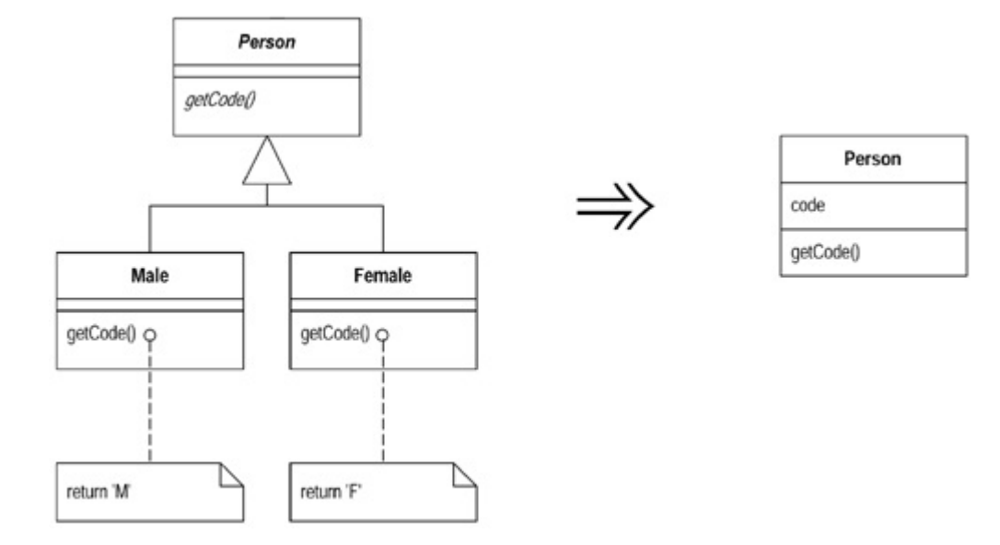

### 1、Self Encapsulated Field (为变量设置 getter 和 setter)

在值域访问方式上，有两派观点，一派认为在该变量定义所在的类中，应该自由地使用这个类，另一派认为即使在这个类中也应该只使用getter访问数据。
**直接访问**的好处是便于阅读。
**间接访问**的好处是，subclass 可以通过 Override 一个函数来改变数据获取的结果，比如你想访问 superclass 中的一个值域，却又想在 subclass 中对这个变量的访问改为计算后的一个值。简介访问也可以支持更灵活的数据管理方式，比如 lazy initialization （只有在用到时才初始化）

### 2、Replace Data Value with Object (用对象替代数据值)

在开发初期，你可能用一个简单的数据项来表示某种特性，但随着开发的进行，这些数据以及与其相关的操作可能会变得复杂。
这时候你可以把和这个数据和相关的操作提取到一个新的对象里。

### 3、Change Value to Reference (将实值对象改为引用对象)

Value Object：实值对象，例如日期，金额这些属性，他们完全由所含的数据值来定义，系统中可能同时存在着多个相同的日期或金额。
Reference Object：引用对象，比如客户。往往这个对象只能存在一个
当遇到不适合重复存在的成员变量时 好，比如用户，我们就需要将其变成一个引用对象。
以用户为例，一种做法是在一开始的时候新建一个哈希表，将所有的用户都存进去。
再将用户类的构造函数的可见性设成私有，保证用户对象不能被新建。
再写一个 get 函数，用来从哈希表中取出事先生成好的用户对象。

### 4、Change Reference to Value (以引用对象改为实值对象)

如果一个引用对象变得很小，且不可变，且不易管理，则可以将其变成一个实值对象。
引用对象的缺点在于它必须背某种方式控制，你总是必须向其控制者请求来获得该对象。他们可能造成内存间的关系复杂。

### 5、Replace Array With Object (用对象替代数组)

数组应该用来容纳一组相似的对象。但如果一个数组容纳了多种不同的对象，则应该用一个 object 来替代这个数组。

### 6、Duplicate Observed Data (复制被监视的数据)

对于一个分层良好的系统，UI 和 Logic 应该分开。不要将数据存一份到 UI class 里，而是通过 observe Logic class 里的数据变化，来动态更新 UI。
MVVM 模式就是典型的示例。

### 7、Change Unidirectional Association to Bidirectional (将单向关联改为双向)

在开发初期，你可能会在两个 classes 之间建立单向的链接，但是随着业务发展，他们可能需要互相引用彼此，此时可以改为双向链接。

### 8、Change Bidirectional Association to Unidirectional (将双向关联改为单向)

双向链接虽然好用，但会增加患复杂度，大量的双向链接容易制造将是对象。
所以当一个类不再需要另一个类的时候，可以去除不必要的关联，使之成为单向链接

### 9、Replace Magic Number with Symbolic Constants (用常量替代魔数)

如果一个数值是有特殊含义的，那么不要直接在代码中使用它。而是创建一个常量，为其命名，并用这个常量替代这个数值。（称之为魔数是因为别人可能完全无法理解这个数字表示什么，而通过命名常量，你可以为这个数字赋予意义）

### 10、Encapsulate Field (将变量声明为 private，并且提供访问函数)

动机：public 数据会降低程序的模块化程度 (modularity)，其他的对象有可能随意访问或修改这项数据。

### 11、Excapsulate Collection (封装 Collection)

getter 函数不应该返回 collection 类型的数据本身，因为这让用户得以修改 collection 里的数据。
正确做法是返回一个 只读映件 (read-only view)

### 12、Replace Record with Data Class

如果你从某个接口得到的外部记录没有被封装在 object 里，例如 c 中的 structure。那么应该建立一个看起来类似这个外部记录的类，把每个对应的值域都设置成 private，并且提供 getter/setter 函数。
虽然目前看起来这个类没什么有用的行为，但后续的重构会解决这个问题。

### 13、Replace Subclass with Fields (以值域取代子类)

如果各个 subclass 的差别只在 [返回常量数据] 的函数身上，则销毁这些 subclasses，在父类中新建一个值域来表示这个函数。
如下示例，在父类中添加值域表示性别，取消两种子类。

